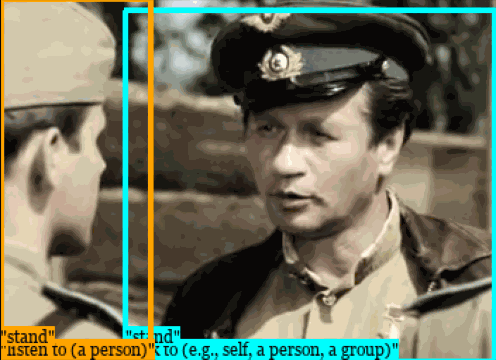
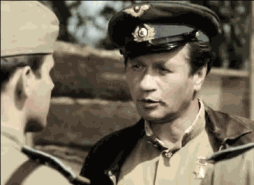
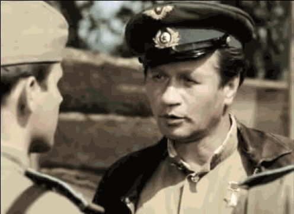
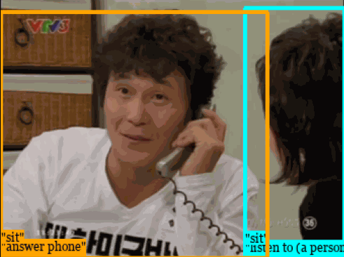

# Classification Matters: Improving Video Action Detection with Class-Specific Attention

### [Paper](https://arxiv.org/abs/2407.19698) | [Project Page](https://jinsingsangsung.github.io/ClassificationMatters/)


This repository is the official implementation of "[Classification Matters: Improving Video Action Detection with Class-Specific Attention](https://arxiv.org/abs/2407.19698)" **(ECCV 2024 Oral)**
> [Classification Matters: Improving Video Action Detection with Class-Specific Attention](https://arxiv.org/abs/2407.19698)   
> [Jinsung Lee](http://jinsingsangsung.github.io)<sup>1</sup>, 
[Taeoh Kim](https://taeoh-kim.github.io)<sup>2</sup>,
[Inwoong Lee](https://scholar.google.co.kr/citations?user=cfl4xNMAAAAJ&hl=ko)<sup>2</sup>,
[Minho Shim](https://research.minhoshim.com)<sup>2</sup>,
[Dongyoon Wee](https://scholar.google.com/citations?user=oEKX8h0AAAAJ&hl=ko)<sup>2</sup>,
[Minsu Cho](https://cvlab.postech.ac.kr/~mcho)<sup>1</sup>,
[Suha Kwak](https://suhakwak.github.io/)<sup>1</sup>\
> POSTECH<sup>1</sup>, NAVER Cloud<sup>2</sup>\
> accepted to ECCV 2024 as an oral presentation 

Detection Result           |  Classification Attention Map 1  | Classification Attention Map 2  |
:-------------------------:|:--------------------:|:--------------------------:|
$~~~~~~$  $~~~~~~$    |  (talk to)  | (listen to) |
$~~~~~~$  $~~~~~~$   | (answer phone)  | $~~~~$ (listen to) $~~~~$  | 


## Installation

  The code works on 
  - Ubuntu 20.04
  - CUDA 11.7.0
  - CUDNN 8.0.5
  - NVIDIA A100 / V100

  Install followings,
  - Python: 3.8.10
  - GCC 9.4.0
  - PyTorch: 2.0.0

  and run the installation commands below:
  ```
  pip install -r requirements.txt
  cd ops
  pip install .
  ```

## Data Preparation

Refer [here](https://github.com/facebookresearch/SlowFast/blob/main/slowfast/datasets/DATASET.md) for AVA preparation.
We use updated annotations (v2.2) of AVA. Download [annotation assets](https://drive.google.com/drive/folders/1irXt04gtqe7jmQ1V79dRB_zRjKVi4gb0?usp=share_link) and place it outside the project folder (``../assets``).

Refer [here](https://github.com/open-mmlab/mmaction2/tree/main/tools/data/ucf101_24) for UCF101-24 preparation.

Refer [here](https://github.com/open-mmlab/mmaction2/blob/main/tools/data/jhmdb/README.md) for JHMDB51-21 preparation.

## Running commands

Our model is trained in two steps: (following [TubeR](https://github.com/amazon-science/tubelet-transformer))

First, it is trained from scratch.
Second, it is trained again, but it uses the transformer weights acquired from the first stage.

For convenience, we provide the pre-trained transformer weights of the first stage that are used to train the model.


### Evaluation Code

```
## Evaluate

# AVA 2.2
python3 evaluate.py --pretrained_path={path to the model to evalute} --config-file=./configuration/AVA22_CSN_152.yaml
python3 evaluate.py --pretrained_path={path to the model to evalute} --config-file=./configuration/AVA22_ViT-B.yaml
python3 evaluate.py --pretrained_path={path to the model to evalute} --config-file=./configuration/AVA22_ViT-B_v2.yaml

# UCF
python3 evaluate.py --pretrained_path={path to the model to evalute} --config-file=./configuration/UCF_ViT-B.yaml

# JHMDB (split 0)
python3 evaluate.py --pretrained_path={path to the model to evalute} --config-file=./configuration/JHMDB_ViT-B.yaml --split 0

```


## Model Zoo

Backbone .pth files are the same ones from [here](https://github.com/amazon-science/tubelet-transformer/tree/main) (CSN152) and [here](https://github.com/MCG-NJU/STMixer) (ViT-B).
We offer this [link](https://drive.google.com/file/d/1mZ_RoJnf24Z6B9OnhDaDoGaFAEdsuEbG/view?usp=share_link) for the aggregated backbone .pth files.
    
  | Dataset | Backbone | Backbone pretrained on | transformer weights | f-mAP | v-mAP | config | checkpoint |
  | :---: | :---: | :-----: | :-----: | :---: | :---: | :---: | :---: |
  | AVA 2.2 | CSN-152 | [K400](https://drive.google.com/file/d/1MzwteHH-1yuMnFb8vRBQDvngV1Zl-d3z/view) | [link](https://drive.google.com/file/d/1whAFMjl1EMe05iXzsYLrW5QBuijsNLc-/view?usp=share_link) | 33.5 | - | [config](configuration/AVA22_CSN152.yaml) | [link](https://drive.google.com/file/d/1wSudYUPZqYoyRaXhXmZCIKB3A-OoKjb1/view?usp=share_link) |
  | AVA 2.2 | ViT-B | [K400](https://drive.google.com/file/d/1MzwteHH-1yuMnFb8vRBQDvngV1Zl-d3z/view) | [link](https://drive.google.com/file/d/1whAFMjl1EMe05iXzsYLrW5QBuijsNLc-/view?usp=share_link) | 32.9 | - | [config](configuration/AVA22_ViT-B.yaml) | [link](https://drive.google.com/file/d/1CHh3raut--38qZ7lvBiqAQD3YPMGQFBX/view?usp=share_link) |
  | AVA 2.2 | ViT-B | [K400, K710](https://pjlab-gvm-data.oss-cn-shanghai.aliyuncs.com/internvideo/distill/vit_b_k710_dl_from_giant.pth) | [link](https://drive.google.com/file/d/1whAFMjl1EMe05iXzsYLrW5QBuijsNLc-/view?usp=share_link) | 38.4 | - | [config](configuration/AVA22_ViT-B_v2.yaml) | [link](https://drive.google.com/file/d/1aRuiCigddeU7F08TQ9-dmKUa81UygmCs/view?usp=share_link) |
  | UCF | ViT-B | [K400](https://drive.google.com/file/d/1MzwteHH-1yuMnFb8vRBQDvngV1Zl-d3z/view) | [link](https://drive.google.com/file/d/1n45GStSoGMpBPZjJdGUlN1sfyZvEMbfb/view?usp=share_link) | 85.9 | 61.7 | [config](configuration/UCF_ViT-B.yaml) | [link](https://drive.google.com/file/d/1qXtmqJHKjEVA7g5BAkg3B6dYh7CXVMC9/view?usp=share_link) |
  | JHMDB (split 0)| ViT-B | [K400](https://drive.google.com/file/d/1MzwteHH-1yuMnFb8vRBQDvngV1Zl-d3z/view) | [link](https://drive.google.com/file/d/1SILHgfZdh81YRm3g5BsIvHgAmy5H3api/view?usp=share_link) | 88.1 | 90.6 | [config](configuration/JHMDB_ViT-B.yaml) | [link](https://drive.google.com/file/d/1JNEIgikJd8qE0jHI9fQPTxWNtHE5eXOq/view?usp=share_link) |
  
## Acknowledgments
Our code is based on [DETR](https://github.com/facebookresearch/detr), [DAB-DETR](https://github.com/IDEA-Research/DAB-DETR), [Deformable-DETR](https://github.com/fundamentalvision/Deformable-DETR), and [TubeR](https://github.com/amazon-science/tubelet-transformer).
If you use our model, please consider citing them as well.

## License
```
Class Query
Copyright (c) 2024-present NAVER Cloud Corp.
CC BY-NC 4.0 (https://creativecommons.org/licenses/by-nc/4.0/) 
```
